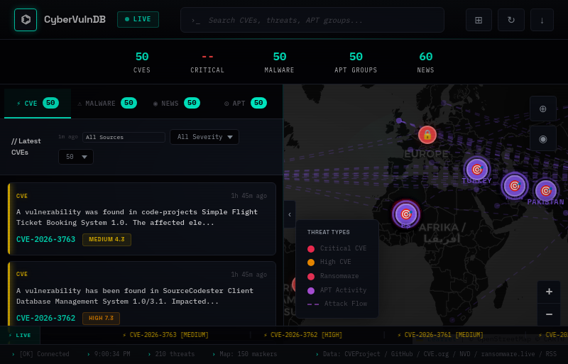
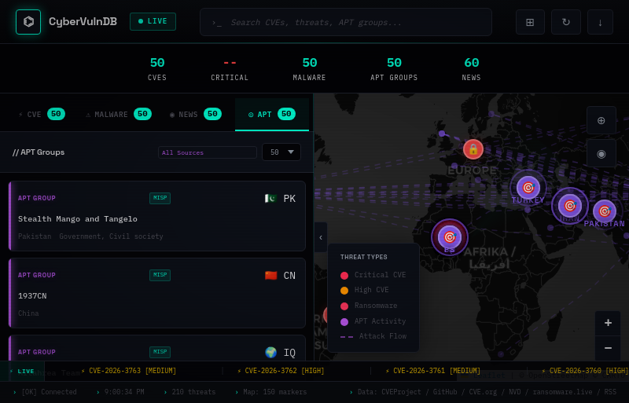
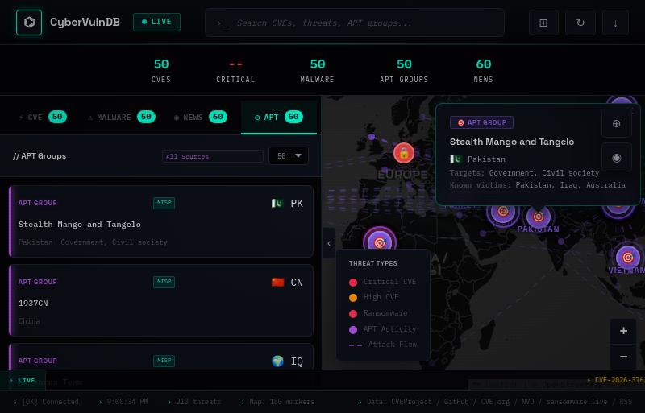

# CyberMonitor — Real-Time Threat Intelligence Dashboard

A terminal-styled cybersecurity intelligence dashboard that aggregates live CVEs, ransomware victims, APT groups, and security news from 15+ free public APIs onto an interactive world map.

🔗 **Live Site**: [https://tryptoph.github.io/Cyber-Monitor/](https://tryptoph.github.io/Cyber-Monitor/)

---

## Screenshots

### Dashboard Overview


### APT Groups Tab


### Map Popup


---

## Features

### 🗺️ Interactive Threat Map
- World map with **color-coded markers** for CVEs (red), ransomware (orange), APT groups (purple), and news (cyan)
- **Pulsing ring animations** on APT origin markers
- **Rich popups** on click — APT shows flag, country, targets, known victims; CVE shows severity, CVSS score, description
- **Attack flow lines** from APT origin countries to victim nations (animated dashes)
- **Country labels** for APT-active nations
- **Radar sweep overlay** and heatmap toggle

### 🛡️ CVE Intelligence
- Live feed from **NVD**, **cvelistV5 (GitHub)**, **GitHub Advisory**, and **CVE.org**
- **EPSS score** (exploit probability) and **KEV badge** (CISA Known Exploited) on each card
- Sorted newest-first, relative timestamps ("2h ago", "just now")
- Source selector: NVD / GitHub Advisory / CVE.org / All Sources
- Count selector: 10 / 50 / 100 entries
- Auto-refresh every **2 minutes**

### 🦠 Malware & Ransomware
- Live ransomware victims from **ransomware.live**, **URLhaus**, and enriched threat data
- Source selector with 5 data sources
- Severity and country attribution per entry
- Auto-refresh every **5 minutes**

### 🕵️ APT Groups
- 50+ tracked APT groups from **MISP Galaxy** (MITRE ATT&CK aligned)
- Country of origin, known aliases, targeted sectors, and known victims
- National flag emojis and attack lines on the map
- Source selector: MISP Galaxy / RSS feeds / All Sources

### 📰 Security News
- 10+ live RSS feeds: Krebs on Security, The Hacker News, BleepingComputer, Schneier on Security, SANS ISC, and more
- HackerNews Algolia API as fallback
- Deduplication by title, sorted newest-first
- Source selector to filter by feed
- Auto-refresh every **3 minutes**

### 🔍 Global Search
- Search across **all 4 panels simultaneously** — CVEs, malware, APT, and news
- **Persists across tab switches** and auto-refreshes
- Matches CVE IDs, descriptions, org names, group names, aliases, targets, and article titles

### 📊 Stats & Ticker
- Live stats bar: total CVEs, malware, APT groups, news articles
- **Animated count-up** effect on data load
- **Live threat ticker** scrolling across the bottom with highlights from all categories

### ⌨️ Keyboard Shortcuts
| Key | Action |
|-----|--------|
| `1` | CVE tab |
| `2` | Malware tab |
| `3` | News tab |
| `4` | APT tab |
| `R` | Refresh data |
| `S` or `/` | Focus search |
| `Esc` | Clear search / close modal |

---

## Data Sources

### CVE
| Source | Lag | Notes |
|--------|-----|-------|
| [NVD API 2.0](https://nvd.nist.gov/developers/vulnerabilities) | ~2h | Primary fallback, newest-first via 2-step pagination |
| [cvelistV5 (GitHub)](https://github.com/CVEProject/cvelistV5) | ~0min | Real-time commits, rate-limited (60/hr) |
| [GitHub Advisory DB](https://github.com/advisories) | ~1h | Via GraphQL, rate-limited |
| [CVE.org](https://www.cve.org/) | ~1h | Official CVE registry |
| [FIRST EPSS](https://www.first.org/epss/) | Daily | Exploit probability scores |
| [CISA KEV](https://www.cisa.gov/known-exploited-vulnerabilities-catalog) | Daily | Known exploited flag |

### Malware / Ransomware
| Source | Notes |
|--------|-------|
| [ransomware.live](https://ransomware.live) | Live ransomware victims API |
| [URLhaus](https://urlhaus-api.abuse.ch/) | Malware URL database |
| [MalwareBazaar](https://bazaar.abuse.ch/) | Recent malware samples |
| [ThreatFox](https://threatfox.abuse.ch/) | IOC database |
| Curated enriched data | Built-in known campaigns |

### APT Groups
| Source | Notes |
|--------|-------|
| [MISP Galaxy](https://github.com/MISP/misp-galaxy) | 100+ MITRE ATT&CK-aligned actors |
| Security RSS feeds | AlienVault OTX, Recorded Future, SANS ISC |

### News
| Source | Notes |
|--------|-------|
| Krebs on Security | Top security journalism |
| The Hacker News | Daily infosec news |
| BleepingComputer | Malware & breach coverage |
| Schneier on Security | Expert analysis |
| SANS Internet Storm Center | Daily threat diaries |
| Dark Reading | Enterprise security |
| SecurityWeek | Industry news |
| Threatpost | Vulnerability coverage |
| CyberScoop | Policy & government |
| HackerNews Algolia | Community security discussions |

---

## Project Structure

```
Cyber-Monitor/
├── index.html          # App shell — layout, panels, map container
├── css/
│   └── style.css       # Terminal dark theme, animations, responsive
├── js/
│   ├── api.js          # All data fetching (15+ APIs, CORS proxies, merge logic)
│   ├── map.js          # Leaflet map, markers, popups, attack lines
│   ├── app.js          # Render functions, search, tabs, auto-refresh
│   ├── ui.js           # Sidebar, toasts, loading state, export
│   └── utils.js        # Time formatting, localStorage helpers
├── lib/
│   └── leaflet/        # Leaflet.js (local copy, no CDN dependency)
├── data/               # Static reference data
└── README.md
```

---

## Running Locally

No build step required — pure static HTML/CSS/JS.

```bash
git clone https://github.com/tryptoph/Cyber-Monitor.git
cd Cyber-Monitor
python3 -m http.server 8080
# open http://localhost:8080
```

---

## Tech Stack

- **Frontend**: HTML5, CSS3, Vanilla JavaScript (ES2020+), zero frameworks
- **Mapping**: [Leaflet.js 1.9](https://leafletjs.com/) with CartoDB dark tiles
- **Data**: 15+ free public APIs, no API keys required
- **Styling**: Terminal dark theme with CSS custom properties, pulsing animations
- **Build**: Zero build step — static files, cache-busted with `?v=N` query strings
- **Hosting**: GitHub Pages
